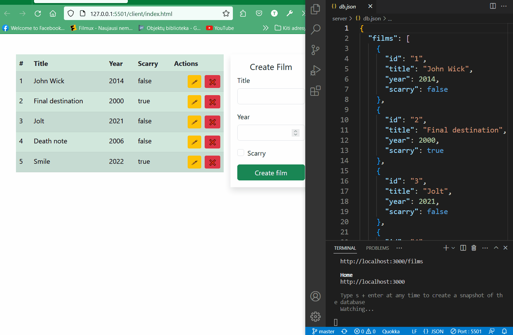

# Fullstack CRUD application by Tomas Bobinas

Program files are divided in thow folders. Server folder has it's own intruction in __readme.md__ folder;

## Aplication exaple

## Code View

You can view code in Visual studio instance using [this link](https://github.dev/tumasas20/js-dom)